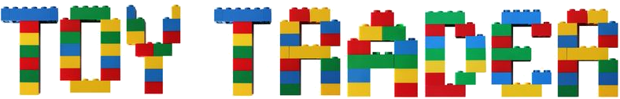

## Overview

Toys are rarely used for the entire duration of their lifespan. This contributes to global waste issues and creates unnecessary financial hardship on consumers. Toy Trader aims to combat these issues by providing a platform that connects individuals who want to trade their no-longer-used toys to others and receive new (to the individual) toys in return.

## Features

- Authenticated Login
- Search toys
- Filter toys with categories such as age range, gender, type of toy
- Reporting system to handle dishonest users
- In app messaging to connect with other users

## Tech Stack

-  IDE - Android Studio
-  SDK - Flutter Multiplatform Framework
-  Language - Dart
-  Backend - Google Firebase

## Credits

Toy Trader app is being created by students as a Senior Project at California State University - Sacramento. 

